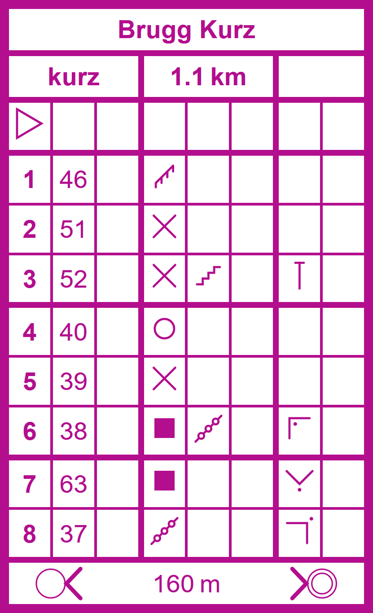

# Control Description Sheet

A web component that allows you to easily create control description sheets for orienteering courses. Uses vector graphics. Check out [this demo](https://city-ol.github.io/control-description-sheet/demo.html) for an overview of the functionality.



## Installation

Either install the package using npm

    npm i @city-ol/control-description-sheet

or include the script:

```html
<script
  type="module"
  src="https://unpkg.com/@city-ol/control-description-sheet/control-description-sheet.js"
></script>
```

## Usage

This web component is made up of two distinct elements

- The `<control-description-sheet>` element, which acts as the parent element and is given the information shown in the header and footer of the sheet as its attributes, i.e. the title (`title`), course name / number (`course`), total distance (`distance`), total elevation gain (`height`) and the distance to the final control (`finalDistance`).

- Each control then corresponds to a `<control-description>` element. The control code must be passed as an attribute (`code`) and the control number is computed automatically. The subsequent columns can be filled with addtional information by specifying the attributes `which`, `feature`, `appearance`, `dimensions`, `location` and `other`. Valid values for these attributes are the keys of the `SYMBOLS` object inside the [`control-description-sheet.js`](control-description-sheet.js) file. These symbols were taken from the [OpenOrienteering Mapper](https://github.com/OpenOrienteering/mapper) software.

The control sheet from the example from above can thus be created as follows:

```html
<control-description-sheet
  title="Brugg Kurz"
  course="kurz"
  distance="1.1&thinsp;km"
  finalDistance="160&thinsp;m"
>
  <control-description></control-description>
  <control-description code="46" feature="fence"></control-description>
  <control-description code="51" feature="crossing"></control-description>
  <control-description
    code="52"
    feature="crossing"
    location="north_end"
    appearance="stairway"
  ></control-description>
  <control-description code="40" feature="special_item_o"></control-description>
  <control-description code="39" feature="crossing"></control-description>
  <control-description
    code="38"
    appearance="linear_thicket"
    location="north_west_corner_inside"
    feature="building"
  ></control-description>
  <control-description
    code="63"
    location="south_corner_outside"
    feature="building"
  ></control-description>
  <control-description
    code="37"
    location="north_east_corner_outside"
    feature="linear_thicket"
  ></control-description>
</control-description-sheet>
```

### Styling

The web component uses a shadow dom and should thus not be affected by the CSS on your website. Some basic styling can be made on the `<control-description-sheet>` element, which also affects the `<control-description>` elements. The supported properties are `color` (sets the color of the text, icons and borders), `width` (total width of the sheet) and `border-radius` (only outermost border). Check out [the demo](https://city-ol.github.io/control-description-sheet/demo.html) to see how this looks like.

```html
<control-description-sheet
  title="Brugg Mittellang"
  course="mittel"
  distance="2.3&thinsp;km"
  finalDistance="160&thinsp;m"
  style="color: black; width: 140px; border-radius: 5px"
></control-description-sheet>
```

## Credits

The icons for the description of individual controls are taken from the [OpenOrienteering Mapper](https://github.com/OpenOrienteering/mapper) software, which is licensed under the GNU General Public License v3.0. No visual changes have been made, but the icons are stored in a modified format.

## License

This project is licensed under the [GNU General Public License](LICENSE.md).
